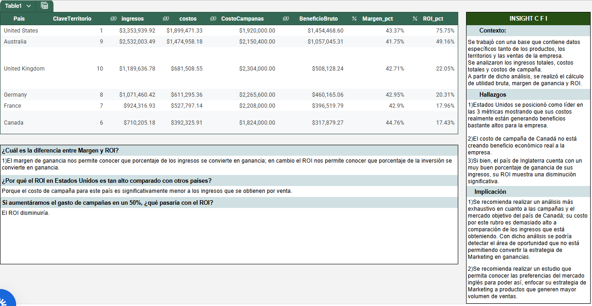

# -Analisis-del-desempeño-financiero-con-SQL---Resumen-ejecutivo-Caso-Practico-Tripleten
Preparación de un informe ejecutivo para el director de finanzas.

Objetivo del análisis:
¿Cuánto estamos ganando por país?
¿Qué tan rentable es cada mercado considerando los gastos de marketing?

📷Resumen Ejecutivo

Para visualizar el archivo Google Sheets resultante, ingresar al siguiente link:
🔗https://docs.google.com/spreadsheets/d/1SfF8AYlxlumiVqb8Z_gZEciAftmgkfyc--Ef_279sWc/edit?usp=sharing
